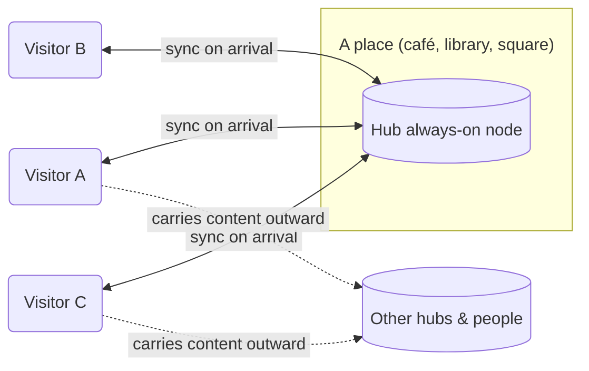

# Freepath

An information network that lives in your pocket and spreads through human contact.

> [!NOTE]
> Freepath is at an early development stage. We are currently in the process of thinking through how this could be
> built — collecting ideas, perspectives, and opinions. If something here resonates with you, we'd love to hear your
> thoughts.

> [!WARNING]
> Freepath uses cryptographic primitives (Ed25519, X25519, ChaCha20-Poly1305) for identity, key agreement, and
> encryption. However, the protocol and its implementation have **not undergone any independent security audit or
> formal cryptographic review**. Do not rely on Freepath to protect sensitive information. Use it for experimentation
> and development purposes only.

🏠 [Homepage](https://smyrgeorge.github.io/freepath)

📱 [Wireframes](https://smyrgeorge.github.io/freepath/wireframes)

---

## Table of Contents

- [The idea](#the-idea)
    - [The name](#the-name)
    - [Why not a social network?](#why-not-a-social-network)
    - [The problem with information today](#the-problem-with-information-today)
    - [Works without the internet](#works-without-the-internet)
    - [It only needs two people](#it-only-needs-two-people)
    - [Participate, not consume](#participate-not-consume)
    - [What makes this different](#what-makes-this-different)
- [TODO](#todo)
- [What Freepath does](#what-freepath-does)
    - [Messaging](#messaging)
    - [Content sharing](#content-sharing)
    - [Micro apps](#micro-apps)
- [You control what you share](#you-control-what-you-share)
    - [No one can collect everything](#no-one-can-collect-everything)
- [How information travels](#how-information-travels)
    - [Slowness as a filter](#slowness-as-a-filter)
    - [Local information ecosystems](#local-information-ecosystems)
    - [The role of strangers](#the-role-of-strangers)
    - [How devices talk to each other](#how-devices-talk-to-each-other)
    - [Hubs](#hubs)
        - [Governance and participation](#governance-and-participation)
- [Privacy and trust](#privacy-and-trust)
- [Content](#content)
    - [Deletion](#deletion)
- [Intelligence at the edge](#intelligence-at-the-edge)
    - [Curation and filtering](#curation-and-filtering)
    - [Smart storage management](#smart-storage-management)
    - [Translation and accessibility](#translation-and-accessibility)
    - [Spam and noise reduction](#spam-and-noise-reduction)
    - [Intelligent propagation](#intelligent-propagation)
    - [Writing assistance](#writing-assistance)
    - [What this is not](#what-this-is-not)
- [Where it could work](#where-it-could-work)
- [Concepts worth exploring](#concepts-worth-exploring)
    - [Presence-based voting](#presence-based-voting)
- [Get involved](#get-involved)

## The idea

Freepath is an information network that works **both online and offline** — without central servers or any central
authority. It spreads through the internet when available, and through people when it isn't.

Instead of routing your messages through a data center, Freepath works the way stories and letters worked for thousands
of years: **person to person, device to device**.

When two phones running Freepath come near each other — at a coffee shop, on a bus, at a concert — they can exchange
content. Posts, messages, updates. Things you wrote. Things people you trust wrote. The network is the crowd itself.

Your phone becomes a node, becomes a small server. You become the infrastructure.

### The name

**Free** — because there are no servers, no gatekeepers, no central authority that can grant or revoke access. The
network belongs to no one, which means it belongs to everyone.

**Path** — because information doesn't have to travel through cables or data centers. It can travel through people. It
follows the routes that humans walk, the places they gather, the moments they cross paths. The path is physical, human,
and alive.

The name is part of this concept and may change as the idea evolves.

### Why not a social network?

We deliberately avoid the term. Not because it's inaccurate, but because it carries too much baggage — timelines,
followers, likes, engagement loops, growth metrics. That's not what this is.

Freepath doesn't aim to compete with or replace the messaging apps and platforms you already use. It doesn't want to be
the next Twitter, or the next Signal. It sees itself as something different in nature: a decentralized layer for sharing
information through the very act of people being in the same place.

Think of it less as an app and more as a concept — an invisible, ownerless current that flows through human proximity.

### The problem with information today

We live in a world saturated with content. More is published every second than any person could read in a lifetime, and
the pace only accelerates. Yet for all this abundance, we seem to be getting worse at evaluating what we read — not
better. Algorithms decide what reaches us, optimizing for reaction rather than reflection. Volume has outpaced
understanding.

We believe part of the problem is structural. When a single platform mediates what billions of people see, the act of
filtering and evaluating information becomes centralized, opaque, and ultimately detached from the communities it
affects.

Freepath doesn't solve this problem outright, but it proposes a different structure. When information travels through
people — when the members of a network are themselves the medium — they naturally become more involved in what they
carry, what they pass on, and what they leave behind. Curation becomes human again. Evaluation happens at the edges, not
at the centre.

### Works without the internet

There is something we find genuinely compelling about a network that does not depend on the internet: information
travels with people. It moves because we move. It reaches places because we go there.

You don't receive anything passively from a server somewhere. You receive because you were present — because you went to
a place, crossed paths with someone, or chose to visit a [hub](#hubs). This is intentional. We believe access to
information should be tied to physical participation, not to a subscription
or an algorithm.

This constraint — that you have to go to the place — is not a limitation we're working around. It's a property we find
worth exploring. It keeps the network grounded in real communities, real spaces, and real encounters. And it makes
decentralization not just an architectural choice, but something you can feel.

When the internet is available, Freepath can **optionally** use it as an additional transport — bridging peers who are
too far apart to meet in person, or reconnecting regions that would otherwise drift. This path is peer-to-peer, end-to-
end encrypted, and uses no central server; it is an extension of the same mesh, not a fallback to traditional
infrastructure. The offline path remains primary. Nothing about the network requires connectivity, and nothing about it
breaks when connectivity disappears.

### It only needs two people

There is no cold start problem here. The network doesn't need a critical mass of users to become useful. It begins the
moment two devices running Freepath are in the same place. That's it. Every conversation, every exchange, every
encounter is already the network working.

This also makes Freepath remarkably cost-effective. The core network runs on hardware people already own — no mandatory
servers, no infrastructure to maintain, no cloud bills to pay. Optional relay nodes, run voluntarily by the community,
can help bridge peers over the internet when it is available, but the network does not require them to function.
Getting started means downloading an application — nothing more.

### Participate, not consume

Part of what we find compelling about peer-to-peer networks is that they only work when their users actually
participate. If everyone only consumed, there would be nothing to relay, nothing to store, no content flowing through
the network at all. Peer-to-peer systems live because people contribute something back — bandwidth, storage, presence —
not because a company runs a fleet of servers on their behalf.

We think this is worth treating as more than a technical property. It is also educational. Using Freepath means
understanding, at some level, that the network is something you help make — not a service that is delivered to you.
Carrying content, hosting a hub, forwarding a message for a stranger, keeping your device on while you walk past
someone else — these are small acts of contribution, and added up, they are the network.

In an era where most digital life is something we receive, we find value in building something where being present also
means being useful.

### What makes this different

Similar ideas are not new. Some apps let people exchange messages over Bluetooth. Others experiment with peer-to-peer
social feeds, or offline mesh networking in specific settings. Each handles a piece of the problem, and a few do it
well.

What we haven't seen is all of these combined into a single substrate — **private messaging, open content sharing, and
a runtime for small third-party applications** — running on the same proximity mesh, the same cryptographic identity,
both online and offline, with no central authority holding any of it together. Each piece on its own is not novel. The
combination is what we find worth building.

## TODO

Open project-level tasks, tracked here so the direction is transparent:

- [x] Build the basic networking layer
- [ ] Move the repository to a different hosting platform
- [ ] Find a better name for the project
- [ ] Register a `.org` domain
- [ ] Design a logo
- [ ] Build a website
- [ ] Thoroughly design the app flows

## What Freepath does

Freepath is a substrate, not a single feature. Several distinct kinds of functionality share the same store-carry-
forward fabric — all running on the same identities, the same cryptography, and the same proximity mesh. The first two
below are the focus of current development; the third is a direction we find worth building toward.

### Messaging

Private, end-to-end encrypted communication between people. A message is encrypted for its recipient and silently
forwarded through the network until it arrives — carried by whichever devices happen to cross paths in between. No
servers hold it, no intermediate carrier can read it, and delivery unfolds at the pace of human movement rather than
the pace of a data centre.

### Content sharing

The open, broadcast layer of the network. Short posts, longer-form articles, photos, links, small videos — signed by
their author and carried outward by whoever chooses to pass them along. Anything published here is visible to anyone
who ends up carrying it, though the author's real-world identity need never be revealed. See [Content](#content) for
the supported formats and the honest trade-offs around storage.

### Micro apps

A longer-term direction. Beyond messaging and posts, Freepath can host small, sandboxed third-party applications that
run *inside* the Freepath client and use the same mesh as everything else. A local marketplace, a community bulletin,
an event board, a reading group, a ticketing tool, a language tutor, a game — each built as a lightweight module, each
distributed and updated through the network itself, each using the user's existing cryptographic identity instead of
demanding a new account. Developers get a distribution channel without running servers of their own; users get useful
tools without leaking yet another data trail. The runtime, permission model, and distribution mechanism are open design
questions — but the direction is deliberate: one substrate, many apps.

> [!NOTE]
> Messaging and content sharing are the focus of current development. Micro apps are a longer-term direction.

## You control what you share

When two phones meet, nothing is exchanged without your consent. You choose the strategy that fits your needs:

- **Starred** — only content you've explicitly marked to propagate
- **Last N posts** — a rolling window of your most recent activity
- **Everything** — your full local store, for those who want to be active carriers
- **Something else entirely** — the model is open, and other strategies are possible

This means propagation itself is decentralized. What spreads through the network is the result of thousands of
individual human decisions — not a private algorithm running on a server somewhere, optimizing for engagement or
burying content without explanation. There is no invisible hand. What travels, travels because people chose to carry it.

### No one can collect everything

Because content is fragmented across thousands of independent devices — each carrying a different subset, chosen by its
owner — it is practically impossible for any single actor to collect the full picture of what exists in the network.
There is no central repository to breach, no database to subpoena, no single point that holds it all.

This might look like a limitation. In some ways it is. But it also means the network has a natural resistance to
surveillance and control. To gather a significant portion of the content, someone would need access to a significant
portion of the people — physically. That is not something that scales easily for a malicious actor.

This fragmentation also quietly protects anonymity. Even if someone intercepts a piece of content, they see only a
fragment of a fragment. The full context — who wrote what, who carried it, who received it — is scattered across the
network in a way that cannot be easily reconstructed.

## How information travels

Think of it like seeds carried by the wind — except the wind is people going about their lives.

You write a post. Your phone stores it. Later, you walk past someone else using Freepath. Your phones notice each other
and exchange what each is missing. That person goes home, walks past their neighbor, sits on a train. The post keeps
spreading — carried physically by humans, hopping from device to device, and where the internet is available, from peer
to peer across it — never through a platform that can control what it carries.

This is called **Store, Carry, Forward**. It's how delay-tolerant networks have operated in research for decades.
Freepath brings this idea to everyday communication.

There is no real-time guarantee. A post might reach someone in minutes, or hours, or days — depending on how connected
the human mesh is. But it will reach them. No algorithm decides otherwise. No moderator can suppress it at the source.
No company can deplatform you from a network that has no platform.

### Slowness as a filter

Freepath has no algorithm engineering virality. Content spreads only because people chose to carry it. This means the
network is naturally slow — and we think that's a good thing.

What survives and propagates is what people found worth passing on. There are no retweet storms, no engagement spikes,
no content that spreads faster than anyone can evaluate it. The pace of propagation is the pace of human movement. That
slowness is a quality filter no platform has ever managed to build deliberately.

### Local information ecosystems

Because propagation follows physical proximity, Freepath naturally forms geographic clusters. A neighbourhood, a
university campus, a city district each develops its own layer of information — local news, local knowledge, local
conversation — without needing a dedicated platform or a moderator to maintain it.

The network doesn't flatten everything into a global feed. It lets communities stay local by default, and connect to
the wider network only through the people who move between them.

### The role of strangers

You may carry content from people you've never met and will never know. Someone writes something in a city you've never
visited. It travels through a dozen hands before it reaches you, silently, as you walk past a stranger on a train. You
don't know the chain. You may not even know the author's name.

### How devices talk to each other

Freepath is designed to work over multiple short-range communication channels, depending on what the devices support:

- **Bluetooth** — the primary channel. Two phones near each other discover and exchange data automatically in the
  background, no interaction needed.
- **Local Wi-Fi** — when devices are on the same network (a home router, a hotspot, an office network), they can sync
  directly without touching the internet.
- **NFC** — for close-range, intentional transfers. Tap two phones together to exchange content instantly.
- **QR codes** — a screen-to-camera protocol for environments where wireless is unavailable or untrusted. One device
  displays a QR code, another scans it. Data can be chunked across multiple codes for larger payloads. See
  [qrt](https://github.com/smyrgeorge/qrt), a project that explores exactly this: encoding data into a sequence of QR
  codes, displaying them as a video on screen, and using a camera to capture and decode the frames.
- **Internet (optional)** — when devices have connectivity, Freepath can exchange messages over the public internet
  using a peer-to-peer transport built on [libp2p](https://libp2p.io/). This extends reach beyond physical proximity —
  bridging distant peers, regions, or hubs — without introducing a central server. Connections are Noise-encrypted at
  the transport layer and end-to-end encrypted at the application layer; relay nodes that help with NAT traversal see
  only opaque ciphertext. This path is strictly additive: the network functions fully without it.

### Hubs

Beyond individual devices, Freepath introduces the concept of **hubs** — dedicated nodes that are always on and always
broadcasting. Unlike a regular phone that only shares content when someone happens to walk by, a hub is a fixed point
people can deliberately visit to collect information.

A hub is not a server in the traditional sense. It holds no special authority, stores no private data, and requires no
account to interact with. It is simply a persistent node, sitting quietly in a place, waiting for devices to come close.

Hubs can be placed anywhere — a cafeteria, a bookshop, a university library, a community centre, a public square. The
operator of a hub decides what content it carries and shares. You decide what you collect from it. You walk in, open the
app, and leave with whatever the hub had to offer.

The content a hub holds is controlled entirely by the owner of that place. It can be **public** — open for anyone who
comes within range to receive — or **encrypted**, accessible only to those who hold the right keys. A university might
broadcast open announcements to all students while keeping internal communications behind access control. A bookshop
might share its curated reading lists with anyone, or reserve them for members. The hub itself enforces nothing — the
content does.

This creates a natural layer of physical distribution points — informal, decentralized, and rooted in real places.

The hub itself does not move; people do. Each visitor leaves with whatever the hub shared with them, and becomes a
carrier for the rest of the network.

#### Governance and participation

The hub concept can be extended further. Rather than being controlled by a single owner, a hub could allow a group of
people to collectively manage its content — through some form of election, delegation, or voting mechanism. Who gets to
publish to a hub, what gets removed, how the hub evolves over time — these could all be decisions made by the community
that gathers around it, not imposed from above.

Hubs can also serve as physical voting points. A hub could pose a question to everyone who comes within range — an
opinion poll, a community decision, a local referendum — and silently collect responses as people pass through. No
central tallying server. No registration. The results exist in the network, carried and aggregated by the people
themselves.

This is still an open idea. The mechanisms are not defined yet — but the direction is deliberate: governance that is
local, participatory, and grounded in physical presence.

We find something worth sitting with in all of this. A network where strangers carry each other's words — not because
they were targeted, not because an algorithm surfaced it, but because a person decided it was worth bringing along.

## Privacy and trust

Every identity in Freepath is a cryptographic keypair — generated on your device, stored nowhere else. You are your key.
No account, no email, no phone number required.

Every piece of content is cryptographically signed. This doesn't mean you know the real-world identity of the author —
Freepath makes no such claim. What it does mean is that you can reliably tell whether two posts or messages were created
by the same person. The signature is a guarantee of consistency, not of identity. Forged or tampered content is
rejected.

Private messages are end-to-end encrypted, readable only by the intended recipient — even as they physically travel
through other people's devices.

Trust is local and personal. You decide who you trust. The network doesn't impose a global reputation system or a
shadowban mechanism. Your feed reflects your own web of trust, not an engagement algorithm.

## Content

Freepath can carry different types of content: short posts, long-form articles, links to external websites, images, or
even small videos.

However, there is an inherent constraint worth being honest about. Because everything is stored locally on each device —
with no cloud, no server, no external storage — space is genuinely limited. A phone is not a data center. Not everything
can travel with you, and not everything will.

For this reason, Freepath prioritizes **text**, and specifically **Markdown** — lightweight, expressive, and nearly
weightless in terms of storage. Photos are supported with care. Heavier content like video is technically possible but
will naturally be limited in practice, and storage policies on each device will reflect that reality.

We see this not as a bug but as an honest consequence of the model — and in some ways, a feature. A network that fits
in your pocket can only carry what a pocket can hold.

### Deletion

If you delete something from your device, it's gone — locally. There is no server to restore it from, no backup in the
cloud, no admin who can retrieve it for you. The only way to get it back is if someone who still carries it crosses your
path and sends it to you again.

We find this concept deeply compelling. Deletion means something here. Content doesn't linger forever on a server
somewhere, out of your reach and out of your control. What you choose to remove, you remove. What survives, survives
because other people decided to keep it — not because a corporation did.

## Intelligence at the edge

Because there is no server mediating between you and the network, every decision about what to keep, show, filter, or
forward happens locally — on your device, on your terms. Over time, the client can grow a small toolbox that helps with
these decisions: filters, summarizers, translators, rankers. Some of it is plain rule-based logic. Some of it may use
small on-device models where they help. Either way, it runs on your hardware, sends nothing outward, and leaves the
choices to you.

### Curation and filtering

The network doesn't impose a global ranking, and it never will. But that doesn't mean you have to read everything. Your
client can help you make sense of what arrives — grouping related posts, flagging content you've already seen in a
different form, or surfacing posts that match interests you've declared. Sorting and filtering happen on your device,
not on a server somewhere.

### Smart storage management

Every device has limits. When space runs out, your client can help decide what's worth keeping based on your own
priorities over time — what you tend to read, what you skip, what you've passed on. These observations stay local and
act locally. Nobody else sees any of this.

### Translation and accessibility

Freepath can carry content from communities that don't share your language. On-device translation means that a post
written in one language can be read in another without routing that text through a cloud service. The author stays
anonymous. The content stays private. The network stays decentralized.

### Spam and noise reduction

Without a central moderator, every device is responsible for its own signal quality. Local filters — built from what
you've marked as noise, not from what a platform decided was acceptable — can quietly drop junk before it reaches your
reading queue. Moderation that belongs to you, not to a trust-and-safety team in a building somewhere.

### Intelligent propagation

Earlier, we described the propagation strategies available to each user — Starred, Last N posts, Everything, and
whatever else the model allows. These are intentional and human-driven. Your client can make them smarter without
removing that human intent, by ranking content against parameters you define: topics you care about, authors you trust,
geographic relevance, recency, or how many hops a post has already traveled.

Some examples of what this could look like in practice:

- **Topic-aware carrying** — you set interests (local politics, hiking trails, independent music) and unrelated content
  ages out of your store first
- **Trust-weighted propagation** — content from authors you've engaged with before, or that has traveled through people
  you trust, is more likely to be carried forward
- **Freshness and decay** — old posts that have already spread widely are deprioritized to make room for newer signals
- **Ethical load** — you can exclude patterns you find harmful, without any external moderation infrastructure
- **Bandwidth sensitivity** — short encounters sync only high-priority items; longer proximity allows broader
  propagation

The parameters are yours. What travels, travels because you decided it should — just with better tools for making that
decision.

### Writing assistance

Composing offline, without connectivity, doesn't mean composing without help. Lightweight on-device tooling can assist
with drafting, editing, or translating your own posts before they go anywhere. Nothing leaves your phone until you
choose to share it.

### What this is not

Intelligence at the edge is not a recommendation engine optimizing for time-on-screen. It is not a classifier deciding
what the network is allowed to carry. It is not surveillance dressed up as assistance. The outputs stay on your device.
The decisions remain yours.

## Where it could work

Freepath is not designed for one specific use case. Any place where people gather, move, and share — without reliable
internet or without wanting to depend on it — is a place where this concept could take root.

- **University campuses** — students sharing lecture notes, event announcements, and local news as they move between
  buildings and common spaces
- **Schools** — teachers and students exchanging materials, announcements, and resources without depending on a platform
  or internet connection
- **Public libraries** — a natural hub for a community's shared knowledge, open to anyone who walks through the door
- **Independent bookshops, cafes, and cultural spaces** — curated content, event listings, local zines, and
  recommendations carried by the people who pass through
- **Local neighbourhood networks** — residents sharing bulletins, alerts, recommendations, and community decisions
  within a few city blocks
- **Markets and fairs** — vendor listings, maps, schedules, and community notices spreading through the crowd
- **Music festivals and open-air events** — schedules, artist info, community boards, and announcements propagating
  organically through the crowd
- **Hiking trails and national parks** — trail conditions, safety alerts, and traveler notes passed between hikers
  moving in opposite directions
- **Sailing and maritime communities** — boats passing in harbours exchanging weather reports, navigation notes, and
  local knowledge
- **Underground and independent press** — journalism and writing that travels through communities without relying on
  platforms that can suppress or deprioritize it
- **Refugee camps and humanitarian zones** — information distribution in areas with no infrastructure, where access to
  communication is critical
- **Protest and activist movements** — organizing and sharing information in environments where connectivity is cut,
  monitored, or unreliable
- **Disaster response zones** — first responders and affected communities sharing real-time information when
  infrastructure has failed

This list is not exhaustive. Wherever people move, the network can follow.

## Concepts worth exploring

The ideas below are not part of the core design — they are extensions that feel natural given the foundation Freepath
builds on. Some overlap with earlier sections; they are collected here because they deserve their own space.

### Presence-based voting

Earlier, we touched on the idea of hubs collecting votes as people pass through. This deserves more careful development.

The principle is simple: **to vote, you have to go to the place**. Not log in, not submit a form, not click a button
from your sofa. You physically travel to a location — a hub, a public square, a community space — and your device
registers your participation. The act of being there is itself meaningful.

This is not just a technical mechanism. It is a statement about what voting should feel like. It reintroduces friction
as a feature. It anchors a decision to a place and a moment. It requires something of the participant beyond a tap on a
screen.

How it could work:

- A hub poses a question — a community proposal, a local decision, a neighbourhood referendum
- Any device that comes within range receives the ballot
- You review it and cast your response locally; your vote is signed with your cryptographic identity, so it cannot be
  duplicated or forged
- The hub collects responses silently as people arrive; other devices carry results outward as they leave
- Tallying is distributed — no single server counts the votes; the result emerges from the network as it propagates

The result is not instant. A vote cast at noon might not be fully aggregated until the end of the day, once enough
devices have passed through and carried the partial tallies outward. But it is verifiable, tamper-resistant, and
requires no central authority to run.

Participation is bounded by physical presence. You cannot vote for a community you have never visited. You cannot cast
ballots from a distance. The network enforces locality not through rules but through physics.

This is still an open direction. Questions of eligibility, double-voting prevention, anonymity, and result verification
are not yet resolved. But the direction feels right: governance that is local, physical, and grounded in the act of
showing up.

## Get involved

This project is in its earliest stage. The best thing you can do right now is:

- **Share your thoughts** — open an issue, start a discussion
- **Spread the idea** — if this resonates with you, tell people
- **Contribute** — if you have experience in mobile development, cryptography, Bluetooth networking, or distributed
  systems, your perspective would be invaluable
